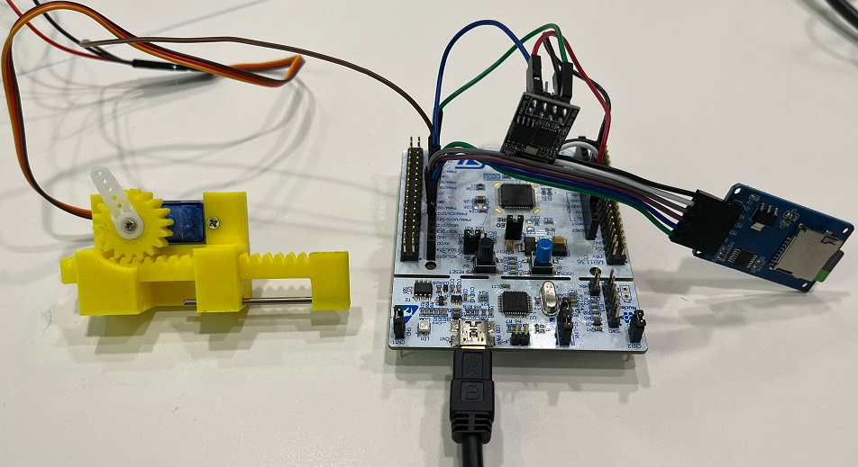

# SmartBLock (Smart Blockchain based Lock)

This is a micro smart lock that is based on the uBitcoin library written in C++. The microcontroller used is 32-bit. By setting up the entire system, one can learn about embedded systems and gain a deeper understanding of how the Bitcoin blockchain functions. This is an efficient system that provides an opportunity for learning and experimentation.

Please note that this system is designed for learning purposes. Thus, a lot of crucial information is revealed in the terminal for debugging purposes (which makes security leak). Therefore, this app is not intended for real-world use and it is your responsibility to ensure that you use it appropriately.

## System 


## Installation

To install the SmartBLock, please follow the instructions  provided in [the installation](docs/Installation.md).


 ## Manuall
In the context of SmartBlock (SBL), there are three parties involved: SBL itself, the owner of the house, and a guest. When the owner agrees to let a guest enter the house, they configure the SBL by sending a transaction with some funds to the lock. Once the lock has been configured, the guest can enter the house by providing the necessary transaction to the lock. At the end of the agreement period, the owner can revoke the grant by sending another transaction. The SBL will return any remaining funds. To setup the system, follow these steps:

1. Ensure that the Bitcoin core node is running on your laptop and accessible via the IP address 191.168.137.1 on the Wi-Fi network named "SSID:Password". ( make sure your hot spot network using this IP range 192.168.137.0/24 )
2. You need to save the public extended keys of the owner and guest as well as the private key of SBL onto the SD memory. All keys must be extended keys. To accomplish this, create three files: "OXPUB.TXT" for the owner's extended public key, "GXPUB.TXT" for the guest's extended public key, and "XPRV.txt" for the SBL extended private key (the file names are important, please follow the recommended names).
3. It is crucial to include the "OXPUB.TXT" and "GXPUB.TXT" files for the system to function properly. However, if the "XPRV.txt" file is missing, it will be generated with default data. Additionally, there is a function that generates proposal keys and stores them in the "KEYGEN.TXT" file, which you can manually copy and use.
4.To speed up synchronization when SBL finds keys, you can use a tool named "headerDownloader.py" located in the "tools" folder. This tool allows you to download block headers in advance, which are required by the smart lock to ensure it has all the headers of blocks in the chain. However, downloading these headers can be time-consuming, so it's better to download them in advance and store them on the SD memory. To download headers in a readable format for the smart lock, you need to have Python installed and then run a specific command. 
```sh
$python headerDownloader/downlowder.py
```
4. When you put all headers in the SD memory, restart SBL, and then it starts to recognize and verify them. you can accelerate the verification by modifying the "VERIFIED.TXT" file. You can find the block height and the previous block hash of the current verified block.
5. The lock reports the status in the serial terminal (USB to COM serial port). The smart lock needs these files to operate as a smart lock, so you need to create these files and put them in the SD memory.
   - "GXPUB.TXT" guest extended public key
   - "OXPUB.TXT" owner extended public key
   - "MNEMONIC.TXT" (Optional) mnemonic words that generate lock private key.
   - "PATH.txt" Derivative PATH "m/10/" (default is m/10/)
   - "PATHINDEX.txt" derivative path index(inPut) (default is 1)
   - "TXIN.txt" transaction input desires to lock the private key and derive the path
   - "WIFI.txt" SSID and password of wifi network (hotspot)
```sh
################ STAT #################
# Derivative PATH : m/10/
# Index (inPut)   : 521
# Lock address  In: n2RywdZjB5g9jwVviQWYN3qMxQWXRh38yN
# Lock address Out: mrKNAFYnamjNsETk5PixyxHywAci6handt
# Script address  : 2N4yQ2DcMaUmAjjvwsZPwrqG5Y89YooxPHR
# TXin ID         : 10a29af960e847e77d948a4b80c0a75b3ffc05e8793e06c9d8948d83bac4085f
# TXin Index      : 2
# Fund (satoshi)  : 42840
# Local Hight     : 2503867
# Verified Hight  : 2503800
# WIFI SSID:PSW   : mohsen
# Owner Xpub----->
tpubD6NzVbkrYhZ4WmpygA4emwLn7ZZWCPFX58GjZ1XTmvkTA4LFC4TCQyozQCc12TcKUqrS83sp5KyNBkyxmrPM68SCx7dgfsBwD7QSt1U9LAT
# Guest Xpub----->
tpubD6NzVbkrYhZ4YbGzfZ2uchThpawBzS7FgaUs3k5AZyapwWB9EkvFV6CyVNT2JWCqACyhWDiHfdityAZajDoQmh9uEPakg1LPV5TXvbpaZFs
# Lock  Xpub----->
tpubD6NzVbkrYhZ4YDpCdJW8s3ihthS5xpojJLVr5Mx82teeeo8oAcs62YLqPYzzGtXQYA7CTNgsV58mxD9R2zkHePtKVTj1cMaBXR1UbHXAdXt
#######################################
```
6. If the smart lock finds all the needed files and synchronizes by downloading and verifying headers. Then it looks for a contract transaction that desires to "Lock address In" which is the lock address with the derived path " Derivative PATH/Index (inPut)".
7. If the smart lock finds the contract, it will wait for a guest who spends the contract. when the contract is spent, the lock executes the unlock operation generates and propagates a new contract, and updates the Index.
8. To create the contract go to the folder "tools" and find "ownerApp.py"
9. To spend a contract go to the folder "tools" and find "guestApp.py"
   


