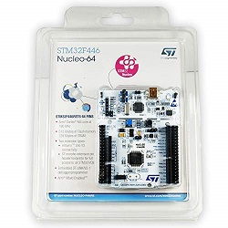
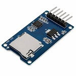

# uSmartlock

This is a micro smart lock based on the C++ Bitcoin library (uBitcoin) for 32-bit microcontrollers. 
 
## Hardware
1. STM32F4re466re microcontroller [Refrence](https://www.st.com/en/evaluation-tools/nucleo-f446re.html)  
2. WiFi module ESP8266 
3. SD Card Memory Shield Adapter 6 PIN SPI Interface & an SD Memory Card
4. Step motor ( to show lock /Unlock operation) </br>
, .jpg) ,  
## Pinout
This is the pinout that we used in our configuration

| Micro SD Adapter pins  | STM32F466re pins |
| ------------- | ------------- |
| CS            | PB6(D10)  |
| SCK           | PA5(D13)  |
| MOSI          | PA7(D11)  |
| MISO          | PA6(D12)  |
| VCC           | VCC 5V    |
| GND           | GND       |

| WiFi Module   | STM32F466re pins |
| ------------- | -------------    |
| Rx            | PA10(D2)         |
| Tx            | PA9(D8)          |
| VCC           | VCC 3,3V         |
| EN            | VCC 3,3V         |
| GND           | GND              |

## A. Required Software
1. Download the latest STM32CubeIDE to compile and download the app on the mainboard (stm32f466re). [Refrence Link](https://www.st.com/en/evaluation-tools/nucleo-f446re.html)
2. Download the latest BitcoinCore to prepare the server environment for the system. [Refrence Link](https://bitcoin.org/en/bitcoin-core/)


## B. Installation of the Lock software 

1. Install the STM32CubeIDE with the default configuration.
2. Create a new STM32 project: Open STM32CubeIDE--> STM32 Project -->find your board / select nucleo-f446re --> choose a name and select C++ as targeted language --> finish
3. Pinout & configuration:
   - System Core:
     GPIO (SD memory interface SPI) --> PB6= OUTPUT enable, Lable= SD_CS
     RCC --> HSE= crystal resource, LSE= crystal resource
     SYS --> Debug= serial Wire, Timebase Source = SysTick
   - Connectivity:
     SP1(SD memory interface SPI)--> Mode= Full-Duplex Master, Prescaler= 128
     USART1(Wifi interface Rc, Tx)--> Mode= Asynchronous, [for ring buffer] DMA setting= add "USART1_RX", NVIC Setting= global interrupt enable
     USART2(Stlink debugger)--> Mode= Asynchronous
    - Clock configuration = HCLK= 32 MHZ
    - Middleware --> FATFS= User-Defined, USE_LFN= Enable on the HEAP
4. Download the files from the repository and put them on the same path in your project( files that don't start with underline "_" differ in each platform and architecture, don't copy them directly)
   - "Core/Inc/"
   - "Core/Src/"
   - "Middlewares/Third_Party/"
5. Configure FATFS
   - Prepare an SD memory card formatted in FAT32 
   - Configure the FATFS API based on this instruction [Tutorial: An SD card over SPI using STM32CubeIDE and FatFS](https://01001000.xyz/2020-08-09-Tutorial-STM32CubeIDE-SD-card/), [github](https://github.com/kiwih/cubeide-sd-card/tree/master)
   - There are some changes that are not in the tutorial, In the tutorial, SP2 is used as communication pins but we are using SP1 for this purpose, and in the part of defines, you need to define hspi1 instead of hspi2. Finally in the file ser_diskio_spi.c, we need to provide our low-level HAL functions instead of the current ones.
```sh
so in main.h Private defines:
/* USER CODE BEGIN Private defines */
//#define SD_SPI_HANDLE hspi2
#define SD_SPI_HANDLE hspi1
/* USER CODE END Private defines */
```    
```sh
so in user_diskio_spi.c :
//#include "stm32f3xx_hal.h" /* Provide the low-level HAL functions */
#include "stm32f4xx_hal.h"
```
6. Configure "uBitcoin library"
     - We need to add the include and source folders of the library to the include and source path of the project. So open the project "properties", and go to "Paths and Symbole" in the C/C++ general tab. Then in the included tab, we select add and put the path of the library to the headers file (GNU C/ GNU C++), in the source tab we add the path of source files.
     - To force the library to use the regular string variable we need to open the configuration file in this path
```sh
${PROJECT_PATH}/Middlewares/Third_Party/uBitcoin/src/uBitcoin_conf.h
```
Add or change these lines
```sh
#define USE_STDONLY
#define DEFAULT_NETWORK Testnet
//#define DEFAULT_NETWORK Mainnet
```
7. Configuration of RingBuffer [STM32 UART Ring Buffer using DMA and IDLE Line](https://controllerstech.com/uart-dma-with-idle-line-detection/), [github](https://github.com/controllerstech/STM32/tree/master/UART%20CIRCULAR%20BUFFER)
- Make sure DMA is added on USART1 and interruption is enabled ( DMA setting= add "USART1_RX", NVIC Setting= global interrupt enable)
- RingBuff uses a variable called "TIMEOUT" to traverse the ring to configure this, we need to add these codes to the interruption file (stm32f4xx_it.c).
```sh
//in file stm32f4xx_it.c
  /* Private variables ---------------------------------------------------------*/
/* USER CODE BEGIN PV */
extern int32_t TIMEOUT;
/* USER CODE END PV */
```
- and also this this

```sh
//in file stm32f4xx_it.c
//in the function void SysTick_Handler(void)
//after calling "HAL_IncTick();"
  /* USER CODE BEGIN SysTick_IRQn 1 */
  TIMEOUT--;
  /* USER CODE END SysTick_IRQn 1 */
```

 - To force the system reset after a hang problem add this code

```sh
//in file stm32f4xx_it.c
//in the function void HardFault_Handler(void)
  /* USER CODE BEGIN HardFault_IRQn 0 */
	printf("\n######	HardFault_Handler	#####   \nReseting.......\r");
	HAL_Delay(2000);
	NVIC_SystemReset();
  /* USER CODE END HardFault_IRQn 0 */
```


8. Finally copy all data in the main.c to main.cpp and add these lines to make it possible to compile C codes inside the cpp file.
```sh
#ifdef __cplusplus
extern "C"
{
#endif
..
..
..
#ifdef __cplusplus
} /* end of extern "C" */
#endif
```
   - We can enable the use of printf if we define this function before the main()
```sh
/* Private user code ---------------------------------------------------------*/
/* USER CODE BEGIN 0 */
/* Retargets the C library printf function to the USART. */
#ifdef __GNUC__
int __io_putchar(int ch)
#else
int fputc(int ch, FILE *f)
#endif
{
    HAL_UART_Transmit(&huart2, (uint8_t *)&ch, 1, 0xFFFF);

    return ch;
}
#ifdef __GNUC__
int _write(int file,char *ptr, int len)
{
    int DataIdx;
    for (DataIdx= 0; DataIdx< len; DataIdx++) {
        __io_putchar(*ptr++);
    }
    return len;
}
#endif
/* USER CODE END 0 */
```
```sh
/* Add this code after HAL_init() to disable buffering the printf */
  /* USER CODE BEGIN Init */
  	  /* Turn off buffers, so I/O occurs immediately */
  	     setvbuf(stdin, NULL, _IONBF, 0);
  	     setvbuf(stdout, NULL, _IONBF, 0);
  	     setvbuf(stderr, NULL, _IONBF, 0);
    /* USER CODE END Init */
```
```sh
/* Private includes ----------------------------------------------------------*/
/* USER CODE BEGIN Includes */
#include "stdio.h"
```

  ## C. Prepare the Bitcoin node as the server
  1. Install the bitcoin core on your laptop
  2. Configure your laptop to work as a hotspot with SSID: smartlock  PW: password ( SSID:PW should be the same in the "smartlock.conf" file stored in the SD memory)
  3. RUN the bitcoin core ( serverip=192.168.137.1 should be the same in the "smartlock.conf" file stored in the SD memory)

- to run you need to go to the installation path

```sh
cd C:\Program Files\Bitcoin
```

- to run RPC server with user:password on the Test net 
     
```sh
bitcoin-qt -testnet -server -rpcpassword=password -rpcuser=user -rpcallowip=0.0.0.0/0 -rpcbind=192.168.137.1
```

- Or on the Main net
      
```sh
bitcoin-qt -server -rpcpassword=password -rpcuser=user -rpcallowip=0.0.0.0/0 -rpcbind=192.168.137.1
```


 ## D. How to use the lock
1. Download the headers of blocks to accelerate synchronization. The smart lock needs to have the headers of the blocks in the chain. As this job takes time we can download them in advance and put them in the SD memory. To download the headers in a way that is readable for the smart lock, we need to have Python installed and then run this command.
    
```sh
$python headerDownloader/downlowder.py
```     


