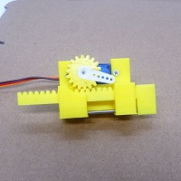

# uSmartlock

This is a micro smart lock based on the C++ Bitcoin library (uBitcoin) for 32-bit microcontrollers. 
 
## Hardware
1. STM32F4re466re microcontroller [Refrence](https://www.st.com/en/evaluation-tools/nucleo-f446re.html)  
2. WiFi module ESP8266 
3. SD Card Memory Shield Adapter 6 PIN SPI Interface & an SD Memory Card
4. Servo motor ( to show lock /Unlock operation) </br>
, .jpg) ,  ,  
## Pinout
This is the pinout that we used in our configuration

| Micro SD Adapter pins  | STM32F466re pins |
| ---------------------- | ---------------- |
| CS        		 | 	  PB6(D10)  |
| SCK        		 |	  PA5(D13)  |
| MOSI       		 | 	  PA7(D11)  |
| MISO       		 | 	  PA6(D12)  |
| VCC        		 | 	  VCC 5V    |
| GND          		 | 	  GND       |

| WiFi Module            | STM32F466re pins |
| ---------------------- | ---------------- |
| Rx        		 | PA10(D2)         |
| Tx         		 | PA9(D8)          |
| VCC       		 | VCC 3,3V         |
| EN           		 | VCC 3,3V         |
| GND           	 | GND              |

| Servo Motor            | STM32F466re pins |
| ---------------------- | ---------------- |
| PWM        	         | PA8(D7)          |
| VCC       	         | VCC 3,3V         |
| GND      	         | GND              |

## A. Required Software
1. Download the latest STM32CubeIDE to compile this application as firmware for your microcontroller (it is called downloading the app on the mainboard (stm32f466re)). [Refrence Link](https://www.st.com/en/evaluation-tools/nucleo-f446re.html)
2. Download the latest BitcoinCore client to prepare the Bitcoin network side environment for the system. [Refrence Link](https://bitcoin.org/en/bitcoin-core/)


## B. Preparing the environment  

1. Have installed the STM32CubeIDE with the default configuration.
2. Create a new STM32 project: Open STM32CubeIDE--> STM32 Project -->find your board / select your board model (nucleo-f446re) --> chose a name and select C++ as targeted language --> finish
3. Pinout & configuration in STM32CubeIDE Project, change the configuration as shown in below:
   - System Core:
     GPIO (SD memory interface SPI) --> PB6 = OUTPUT enable, Lable= SD_CS
     RCC --> HSE= crystal resource, LSE= crystal resource
     SYS --> Debug= serial Wire, Timebase Source = SysTick
   - Timer: TIM1 (To drive servo motor)--> Clock source= internal clock, Chanell= PWM generation ch1, prescalar= <yourCPUclock/50>-1 , Counterperiod= 1000-1
   - Connectivity:
     SP1(SD memory interface SPI)--> Mode= Full-Duplex Master, Prescaler= 128
     USART1(Wifi interface Rc, Tx)--> Mode= Asynchronous, [for ring buffer] DMA setting= add "USART1_RX", NVIC Setting= global interrupt enable
     USART2(Stlink debugger)--> Mode= Asynchronous
    - Clock configuration = HCLK= 32 MHZ
    - Middleware --> FATFS= User-Defined, USE_LFN= Enable on the HEAP
4. Download the files from the repository and put them on the same path in your project( files that don't start with underline "_" differ in each platform and architecture, don't copy them directly)
   - "Core/Inc/"
   - "Core/Src/"
   - "Middlewares/Third_Party/"
5. Configure FATFS
   - Prepare an SD memory card formatted in FAT32 
   - Configure the FATFS API based on this instruction [Tutorial: An SD card over SPI using STM32CubeIDE and FatFS](https://01001000.xyz/2020-08-09-Tutorial-STM32CubeIDE-SD-card/), [github](https://github.com/kiwih/cubeide-sd-card/tree/master)
   - There are some changes that are not in the tutorial, In the tutorial, SP2 is used as communication pins but we are using SP1 for this purpose, and in the part of defines, you need to define hspi1 instead of hspi2. Finally in the file ser_diskio_spi.c, we need to provide our low-level HAL functions instead of the current ones.
```c++
so in main.h Private defines:
/* USER CODE BEGIN Private defines */
//#define SD_SPI_HANDLE hspi2
#define SD_SPI_HANDLE hspi1
/* USER CODE END Private defines */
```    
```c++
so in user_diskio_spi.c :
//#include "stm32f3xx_hal.h" /* Provide the low-level HAL functions */
#include "stm32f4xx_hal.h"
```
6. When you finish the project configuration you need to generate code. So go to the tab "Project" and clock on "Generate code" or press (ALT + K). Then the STM32CubeIDE generates the needed code to enable the configuration that you did. you can find the code in the "Core/Src/main.c" file of your project. But we will change the file to "main.cpp" to be able to use c plus plus headers (check the step 9).
7. When the project is generated we need to add our library to the project, to add "uBitcoin" library to the project:
     - Have copied the library folders from this git in your project to the folder with the same name and path.
     - We need to add the include and source folders of the library to the include and source path of the project. So open the project "properties", and go to "Paths and Symbole" in the C/C++ general tab. Then in the included tab, we select "add" and put the path of the library headers file (in both GNU C/ GNU C++ tabs) (in this case header files are in the "src" folder), in the source tab we add the path of source files ("src" folder).
     - To force the library to use the regular string variable we need to open the configuration file in this path
```sh
${PROJECT_PATH}/Middlewares/Third_Party/uBitcoin/src/uBitcoin_conf.h
```
Add or change these lines
```c++
#define USE_STDONLY
#define DEFAULT_NETWORK Testnet
//#define DEFAULT_NETWORK Mainnet
```
8. After adding the library we need to configure the RingBuffer [STM32 UART Ring Buffer using DMA and IDLE Line](https://controllerstech.com/uart-dma-with-idle-line-detection/), [github](https://github.com/controllerstech/STM32/tree/master/UART%20CIRCULAR%20BUFFER)
- Make sure DMA is added on USART1 and interruption is enabled ( DMA setting= add "USART1_RX", NVIC Setting= global interrupt enable)
- RingBuff uses a variable called "TIMEOUT" to traverse the ring to configure this, we need to add these codes to the interruption file (in file stm32f4xx_it.c).
```c++
//in file stm32f4xx_it.c
  /* Private variables ---------------------------------------------------------*/
/* USER CODE BEGIN PV */
extern int32_t TIMEOUT;
/* USER CODE END PV */
```
- and also this this (in file stm32f4xx_it.c)

```c++
//in file stm32f4xx_it.c
//in the function void SysTick_Handler(void)
//after calling "HAL_IncTick();"
  /* USER CODE BEGIN SysTick_IRQn 1 */
  TIMEOUT--;
  /* USER CODE END SysTick_IRQn 1 */
```

 - To force the system reset after a hang problem add this code (in file stm32f4xx_it.c)

```c++
//in file stm32f4xx_it.c
//in the function void HardFault_Handler(void)
  /* USER CODE BEGIN HardFault_IRQn 0 */
	printf("\n######	HardFault_Handler	#####   \nReseting.......\r");
	HAL_Delay(2000);
	NVIC_SystemReset();
  /* USER CODE END HardFault_IRQn 0 */
```


9. Finally copy all data in the main.c to main.cpp (you need to create this file) and add these lines to make it possible to compile C codes inside the cpp file. You should put all your functions between these definitions. (check the step 6) If you check the main.cpp in the repository you can see how it works. Do not forget to exclude the main.c from the build list (by Right Clicking on the file / Resource Configuration / Exclude from Build/ select all / ok)
```c++
#ifdef __cplusplus
extern "C"
{
#endif

<your function should be placed here>

#ifdef __cplusplus
} /* end of extern "C" */
#endif
```
10. We need to enable printf()/cout<< functions in our project, to do this, we need to define this function before the "main()" function in the "Core/Src/main.cpp". You can put it between "/* USER CODE BEGIN 0 */" and "/* USER CODE END 0 */"
```c++
/* Private user code ---------------------------------------------------------*/
/* USER CODE BEGIN 0 */
/* Retargets the C library printf function to the USART. */
#ifdef __GNUC__
int __io_putchar(int ch)
#else
int fputc(int ch, FILE *f)
#endif
{
    HAL_UART_Transmit(&huart2, (uint8_t *)&ch, 1, 0xFFFF);

    return ch;
}
#ifdef __GNUC__
int _write(int file,char *ptr, int len)
{
    int DataIdx;
    for (DataIdx= 0; DataIdx< len; DataIdx++) {
        __io_putchar(*ptr++);
    }
    return len;
}
#endif
/* USER CODE END 0 */
```

 - Also we need to add this line to disable buffer and see the results of print()/cout<< function immediately.

```c++
/* Add this code after HAL_init() to disable buffering the printf */
  /* USER CODE BEGIN Init */
  	  /* Turn off buffers, so I/O occurs immediately */
  	     setvbuf(stdin, NULL, _IONBF, 0);
  	     setvbuf(stdout, NULL, _IONBF, 0);
  	     setvbuf(stderr, NULL, _IONBF, 0);
    /* USER CODE END Init */
```
- Also add this header to be able to recognize the function.
 
```c++
/* Private includes ----------------------------------------------------------*/
/* USER CODE BEGIN Includes */
#include "stdio.h"
```

11. In The final edit we need to add the headers of our projects and put the needed functions in the "while()" loop

```c++
/* Private includes ----------------------------------------------------------*/
/* USER CODE BEGIN Includes */
#include <____uSmartLock.h>
#include "_exampleGen.h"
```
- In the while loop we have "_exampleGen();" which generates the keys that we used and the variable "keys, TXIN, NodeIP, NodePort" and smart lock function "uSmartLock(NodeIP, NodePort, &keys, &TXIN)):"

```c++
  /* USER CODE BEGIN WHILE */
  while (1)
  {
	  lockDataStruct keys;
	  txinDataStruct TXIN;
	  uint8_t NodeIP[]="192.168.137.1";
	  uint8_t NodePort[]="18332";
	  _exampleGen();
	  //Control the servo motor
	  HAL_TIM_PWM_Start(&htim1, TIM_CHANNEL_1); //enabale tim
	  HAL_Delay(1000);
	  htim1.Instance->CCR1 = 25;  // Lock (duty cycle is 2.5 ms) meaning 180 degree
	  if(____uSmartLock(NodeIP,NodePort, &keys, &TXIN)){
		  htim1.Instance->CCR1 = 125;  //  Open-Unlock (duty cycle is .5 ms) meaning 0 degree
		  HAL_Delay(20000);
		  htim1.Instance->CCR1 = 25;  // Lock (duty cycle is 2.5 ms) meaning 180 degree
		  HAL_Delay(1000);
	  }
	  /* USER CODE END WHILE */
```

12.   It is good to know that these codes in the main.cpp file controls the servo motor 
    
```c++
  HAL_TIM_PWM_Start(&htim1, TIM_CHANNEL_1);
  htim1.Instance->CCR1 = 25;  // Open-Unlock (duty cycle is .5 ms) meaning 0 degree
  HAL_Delay(10000);
  htim1.Instance->CCR1 = 125;  // Lock (duty cycle is 2.5 ms) meaning 180 degree	  
```

  ## C. Prepare the Bitcoin node as the server
  1. Install the bitcoin core on your laptop
  2. Configure your laptop to work as a hotspot with SSID: smartlock  PW: password ( SSID:PW should be the same in the "WIFI.txt" file stored in the SD memory)
  3. RUN the bitcoin core ( serverip=192.168.137.1 should be the same with data in the file "Core/Src/main.cpp" "NodeIP, NodePort" ). This IP is in the range of the default IP of Windows hotspot solution.

- First, go to the installation path by this command (it shows the default path of installation, go to the path of your BitoinCore )

```sh
cd C:\Program Files\Bitcoin
```

- Then run the RPC server with  user:password on the Test-net network (consider in this implementation rpc user is "user" and rpc password is "password". It is hardcoded , so if you want to change it you to reproduce the project)
     
```sh
bitcoin-qt -testnet -server -rpcpassword=password -rpcuser=user -rpcallowip=0.0.0.0/0 -rpcbind=192.168.137.1
```

- Or on the Main net
      
```sh
bitcoin-qt -server -rpcpassword=password -rpcuser=user -rpcallowip=0.0.0.0/0 -rpcbind=192.168.137.1
```


 ## D. How to use the lock
Here we have a lock that is managed by the owner and is rented by the guest. By considering this
1. Run the Bitcoin core node on your laptop and make sure that it is accessible from your laptop hotspot network. (so it would be accessible through the IP 191.168.137.1 on the wifi network defined as SSID:PW ).
2. Build the uSmartLock project for your board based on the instructions above. and run it . In the beginning, it will generate the needed keys and will put them in the file "KEYGEN.TXT". BUT don't forget you have to put manually the extended public key of the owner and the guest by creating "OXPUB.TXT" and "GXPUB.TXT" which you can find in the file "KEYGEN.TXT".
3. Go to the folder "tools" in this repository and find "headerDownloader.py". With this tool, you can download the headers of blocks to accelerate synchronization. The smart lock needs to have the all headers of the blocks in the chain. As this job takes time we can download them in advance and put them in the SD memory. To download the headers in a way that is readable for the smart lock, we need to have Python installed and then run this command.
    
```sh
$python headerDownloader/downlowder.py
```
4. The lock reports the status in the serial terminal. For example, In the stat block, you will find the report like this,
   you need to create these files and put them in the SD memory.
   - "GXPUB.TXT"
   - "GXPUB.TXT"
   - "MNEMONIC.TXT" (Optionall)
   - "PATH.txt"
   - "PATHINDEX.txt"
   - "TXIN.txt"
   - "WIFI.txt"
```sh
################ STAT #################
# Derivative PATH : m/10/
# Index (inPut)   : 521
# Lock address  In: n2RywdZjB5g9jwVviQWYN3qMxQWXRh38yN
# Lock address Out: mrKNAFYnamjNsETk5PixyxHywAci6handt
# Script address  : 2N4yQ2DcMaUmAjjvwsZPwrqG5Y89YooxPHR
# TXin ID         : 10a29af960e847e77d948a4b80c0a75b3ffc05e8793e06c9d8948d83bac4085f
# TXin Index      : 2
# Fund (satoshi)  : 42840
# Local Hight     : 2503867
# Verified Hight  : 2503800
# WIFI SSID:PSW   : mohsen
# Owner Xpub----->
tpubD6NzVbkrYhZ4WmpygA4emwLn7ZZWCPFX58GjZ1XTmvkTA4LFC4TCQyozQCc12TcKUqrS83sp5KyNBkyxmrPM68SCx7dgfsBwD7QSt1U9LAT
# Guest Xpub----->
tpubD6NzVbkrYhZ4YbGzfZ2uchThpawBzS7FgaUs3k5AZyapwWB9EkvFV6CyVNT2JWCqACyhWDiHfdityAZajDoQmh9uEPakg1LPV5TXvbpaZFs
# Lock  Xpub----->
tpubD6NzVbkrYhZ4YDpCdJW8s3ihthS5xpojJLVr5Mx82teeeo8oAcs62YLqPYzzGtXQYA7CTNgsV58mxD9R2zkHePtKVTj1cMaBXR1UbHXAdXt
#######################################
```
6. When you put all headers in the SD memory, restart the smart-lock, and then it starts to recognize and verify them. you can accelerate the verification by modifying the "VERIFIED.TXT" file. You can find the block height and the previous block hash of the current verified block.
   


